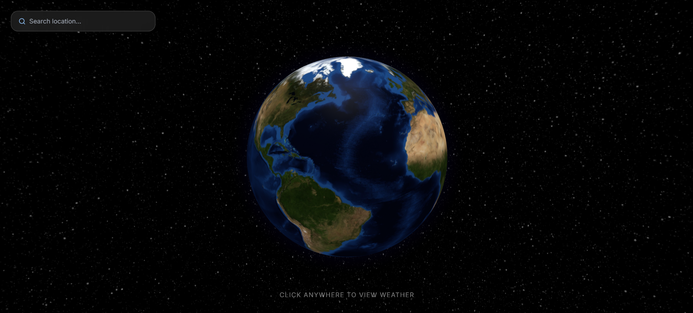
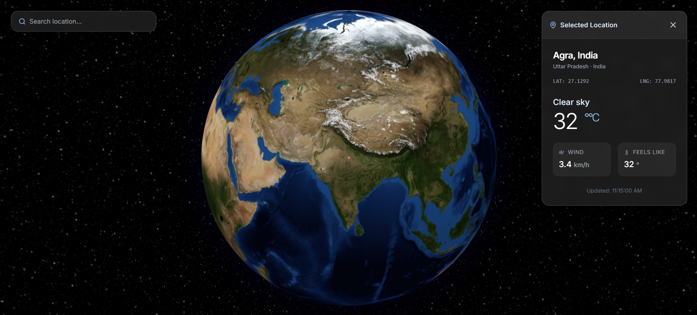
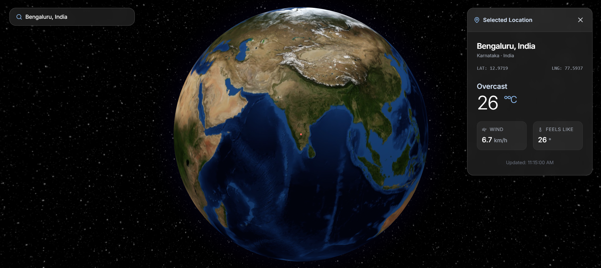

<div align="center">

# 🌍 Global Weather Explorer

A minimalist 3D globe web app. Click anywhere on Earth to view real-time weather — no API key required.

[](https://vitejs.dev/)
[](https://open-meteo.com/)

</div>

## 🔗 Live Demo

**Try it now:** [https://globe-weather-explorer.vercel.app/](https://globe-weather-explorer.vercel.app/)

Deployed on [Vercel](https://vercel.com/). Click anywhere on the globe to fetch live weather.

## ✨ What it is

**Global Weather Explorer** is a single-page web application that renders an interactive, auto-rotating 3D globe. Click any point on the planet and the app fetches and displays the current weather for that location — temperature, wind speed, and conditions — using the free [Open-Meteo API](https://open-meteo.com/).

There is **no API key, signup, or backend** involved. Everything runs client-side in the browser.

## 📸 Screenshots

| Initial view | After clicking a location | Manual search |
| --- | --- | --- |
|  |  |  |

## 🚀 Features

- **Interactive 3D globe** — drag to rotate, scroll to zoom, with a purple atmospheric glow and auto-rotation.
- **Click-to-explore** — click anywhere on the globe to drop a marker and fetch live weather for that exact coordinate.
- **Real-time weather** — temperature, wind speed, "feels like", and a human-readable condition (e.g. *Light drizzle*), driven by WMO weather codes.
- **No API key** — uses the open, key-less Open-Meteo forecast endpoint.
- **Glassmorphism UI** — a frosted-glass info card slides in with a loading spinner while data is fetched.
- **Fully client-side** — no server, no secrets, no build-time configuration.

## 🛠️ Tech Stack

| Layer | Tool |
| --- | --- |
| Build tool | [Vite](https://vitejs.dev/) 6 |
| 3D globe | [globe.gl](https://github.com/vasturiano/globe.gl) 2.32 |
| Rendering | [three.js](https://threejs.org/) 0.157 (UMD) |
| Weather data | [Open-Meteo](https://open-meteo.com/) API |
| Styling | [Tailwind CSS](https://tailwindcss.com/) (CDN), Inter font |
| Icons | [Lucide](https://lucide.dev/) |

> The app is a single, self-contained `index.html`. Libraries are loaded via UMD `<script>` tags so it runs even without a bundler step.

## 🏁 Getting Started

**Prerequisites:** [Node.js](https://nodejs.org/) 16+ (18+ recommended).

```bash
# 1. Install dependencies
npm install

# 2. Start the dev server
npm run dev
```

Then open the printed local URL (default **http://localhost:3000**) in your browser.

To build a production bundle:

```bash
npm run build     # outputs to dist/
npm run preview   # serve the built bundle locally
```

## 🌐 How it works

1. On load, the globe initializes with an Earth texture, atmospheric glow, and slow auto-rotation.
2. Clicking the globe calls `onGlobeClick({ lat, lng })`, which:
   - stops rotation and zooms toward the clicked point,
   - drops a red marker at the coordinate,
   - shows the info card in a loading state,
   - calls `https://api.open-meteo.com/v1/forecast?latitude=…&longitude=…&current=temperature_2m,weather_code,wind_speed_10m`.
3. The response populates the card with temperature, wind, and a WMO-derived condition description.
4. Closing the card clears the marker and resumes auto-rotation.

## 📁 Project Structure

```
global-weather-explorer/
├── index.html          # The entire app (markup, styles, and logic)
├── package.json        # Vite scripts and dev dependencies
├── vite.config.ts      # Vite configuration
├── tsconfig.json       # TypeScript configuration
├── metadata.json       # App name & description
└── screenshots/        # Images used in this README
```

## 🔗 Data Source

Weather data is provided by [Open-Meteo](https://open-meteo.com/) — a free, open, no-key-required weather API. No account or API key is needed to run this project.

## 🌐 Deploy on Vercel

This is a static Vite app. To deploy your own fork:

1. Push this repo to GitHub.
2. In [Vercel](https://vercel.com/), **Import** the repository.
3. Vercel auto-detects Vite — **Build Command:** `npm run build`, **Output Directory:** `dist`. No environment variables needed.
4. Deploy. The live URL is generated automatically.

## 📄 License

This project is provided as-is for learning and exploration.

---

<p align="center">
  Built as a lightweight, client-only visualization. Click the globe and explore.
</p>
